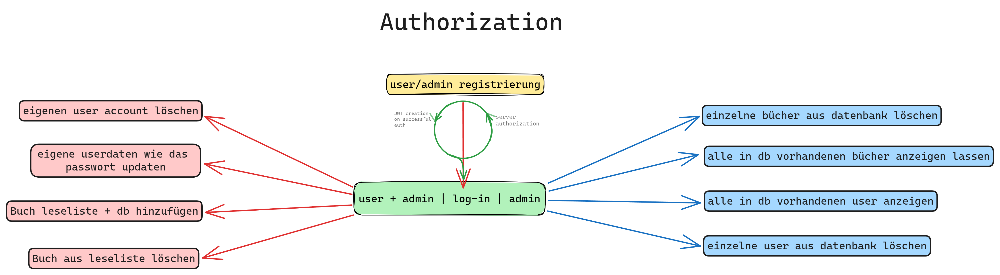

# DCI FBW-WD-D07 BE Final Project

### Book Readlist Server

Sign up and save books to a personalized readlist only you have access to!

---

### How to

**In the Terminal in side the backend directory:**

`npm start`

`npm run dev`

**_In Thunder Client:_**

### As a USER

#### Sign up

Create a POST request

Route:

`https://be-final-group-project-bookt-jacky-manu.onrender.com/users/signup`

Body => Form-encode:

```
username
email
password
```

> add your prefered username, email and password as the VALUE

#### Log in

Create a POST request

Route:

`https://be-final-group-project-bookt-jacky-manu.onrender.com/users/login`

Body => Form-encode:

```
username
password
```

> enter the username and password you used during the sign up step

> You will get a token at the bottom of the response. Copy the token, you will need that soon

#### Save a book to your readlist (and the collection if it's not already in it)

Create a POST request

Route:

`https://be-final-group-project-bookt-jacky-manu.onrender.com/books/addBooks`

Headers =>

```
Authorization
```

> Paste the token you got during your log in as the VALUE of 'Authorization'

Body => Form-encode:

```
tile
author
genre
description
cover
published
olid
```

> add the data in you want to save in its respective VALUE field

> title, author, published and olid are required. olid's need to be unique. For example an olid can look like this: OLIDA1B2

#### Get your readlist

Create a GET request

Route:

`https://be-final-group-project-bookt-jacky-manu.onrender.com/users/getReadlist`

Headers =>

```
Authorization
```

> Paste the token you got during your log in as the VALUE of 'Authorization'

#### Update your credentials

Create a PUT request

Route:

`https://be-final-group-project-bookt-jacky-manu.onrender.com/users/updateUser`

Headers =>

```
Authorization
```

> Paste the token you got during your log in as the VALUE of 'Authorization'

Body => Form-encode:

```
password/email etc
```

> add your new password to the VALUE field

> note: you need to log in again and copy the new token

#### Delete a book from your readlist

Create a DELETE request

Route:

`https://be-final-group-project-bookt-jacky-manu.onrender.com/users/deleteBookFromReadlist/:bookID`

Instead of `:bookID`, you paste the `_id` of the respective book you want to remove from your list. You will see the `_id` inside the response you get when you get your readlist.

For example:

```
// response
{
  "title": "Hier ist deine Leseliste, ADMIN_Manu:",
  "usersReadlist": [
    {
      "_id": "64b53b147cf121929ef1c7cd",
      "title": "Harry Potter und der Stein der Weisen",
      "author": "JK Rowling",
      "published": 1996
    }
  ]
}
```

```
// adress
https://be-final-group-project-bookt-jacky-manu.onrender.com/users/deleteBookFromReadlist/64b53b147cf121929ef1c7cd
```

Headers =>

```
Authorization
```

> Paste the token you got during your log in as the VALUE of 'Authorization'

#### Delete your entire User Account

Create a DELETE request

Route:

`https://be-final-group-project-bookt-jacky-manu.onrender.com/users/userDeleteSelf`

Headers =>

```
Authorization
```

> Paste the token you got during your log in as the VALUE of 'Authorization'

---

### As an ADMIN

#### Sign up

Create a POST request

Route:

`https://be-final-group-project-bookt-jacky-manu.onrender.com/users/signup`

Body => Form-encode:

```
username
email
password
role
```

> add your prefered username, email and password as the VALUE

> if you want admin rights, you need to assign 'admin' as a VALUE for 'role'

Log in, save book to readlist, get readlist, update user, delete book from readlist and delete your account all work the same as an admin as they do from a user perspective.

The admin role can do a couple extra things though:

#### Get a list of all books saved in the database, not just in your readlist

Create a GET request

Route:

`https://be-final-group-project-bookt-jacky-manu.onrender.com/books/`

Headers =>

```
Authorization
```

> Paste the token you got during your log in as the VALUE of 'Authorization'

#### Delete a book the database

Create a DELETE request

Route:

`https://be-final-group-project-bookt-jacky-manu.onrender.com/books/adminDeleteUser/:id`

Instead of `:id`, you paste the `_id` of the respective book you want to remove from your list. Similar to the way you delete a book from your readlist, you will see the `_id` inside the response you get when you get your readlist or get all books.

Headers =>

```
Authorization
```

> Paste the token you got during your log in as the VALUE of 'Authorization'

#### Get a list of all registered users

Create a GET request

Route:

`https://be-final-group-project-bookt-jacky-manu.onrender.com/users/adminGetAllUsers`

Headers =>

```
Authorization
```

> Paste the token you got during your log in as the VALUE of 'Authorization'

#### Delete a specific user

Create a DELETE request

Route:

`https://be-final-group-project-bookt-jacky-manu.onrender.com/adminDeleteUser/:id`

Instead of `:id`, you paste the `_id` of the respective user you want to remove from your list. You will see the `_id` inside the response you get when you get all users.

Headers =>

```
Authorization
```

> Paste the token you got during your log in as the VALUE of 'Authorization'

### Created by

-   [Jacqueline Scharrer-Weißgerber](https://github.com/jacqueline-s-w)

-   [Manuel Fahrenholz](https://github.com/mrbubbles-src)

### Infographics

##### Authorization



##### Saving book to readlist/db


